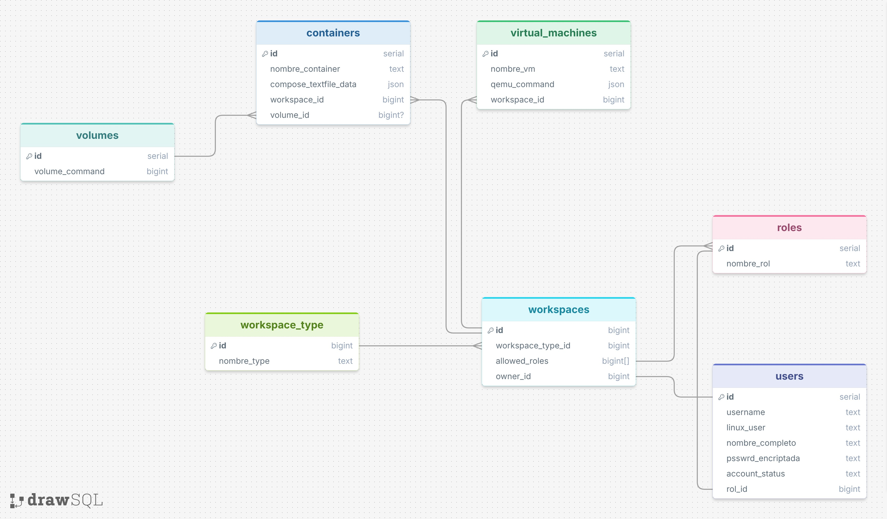

# CIICCTE-server

## Sobre el proyecto

Repositorio monolitico dedicado a la infraestructura de gestion del servidor mediante una interfaz web

Este repositorio unifica los tres componentes que antes estaban separados:

- `CIICCTE-server-DB/` - infraestructura de base de datos con Postgres y pgAdmin
- `CIICCTE-server-backend-V2/` - servidor que expone la logica del sistema y los endpoints
- `CIICCTE-server-frontend/` - interfaz visual para interactuar con el sistema

## Tech stack

Por motivos de documentacion, este es el stack de tecnologias usado para el desarrollo de este repo

- postgresql como base de datos, corre en el puerto 5432
- pgadmin para consultar la base de datos de manera visual, corre en el puerto 8080
- python como lenguaje de programacion debido a su facilidad de uso
- fastapi como servidor debido a su facilidad de uso y rendimiento
- sqlmodel por ser un proyecto mantenido por el equipo de fastapi y ser un wrapper alrededor de sqlalchemy
- fastfetch para obtener detalles del servidor linux
- vite para el servidor y por el ecosistema de desarrollo
- tailwindcss para desarrollar de manera rapida el apartado estetico
- react para iterar de manera rapida y estandarizada para el desarrollo del frontend
- typescript como lenguaje para el frontend
- docker como runtime de contenedores
- docker compose para el despliegue de los contenedores

Diagrama del esquema planeado para la base de datos (referencia grafica, no crea tablas):



El archivo `drawsql/v3.sql` es solo para cargar este diseno en https://drawsql.app. Las tablas reales se crean via SQLModel ORM.

## Dev tools

Herramientas usadas durante el desarrollo que no forman parte del stack de produccion:

- uv para gestionar la version de python y las dependencias del backend. Crea el entorno virtual y sincroniza `pyproject.toml` con `uv.lock`.
- bun como runtime de javascript y gestor de paquetes del frontend. Se usa para instalar dependencias y correr `vite` en desarrollo.
- nix para instalar dependencias a nivel de contenedor en el backend (`python314`, `fastfetch`, `uv` via `nix profile add`). El `dockerfile` del backend parte de `nixos/nix`.
- bruno como alternativa a postman o curl para probar los endpoints. Permite crear peticiones repetibles y colecciones versionadas en `bruno/` (endpoints `get_linux_users.yml`, `linux_server_details.yml`, etc).
- ruff para el formato y linting de python.
- opencode junto a Muse Spark como agentes de IA usados para generar documentacion, crear el compose unificado y reorganizar el repositorio. La trazabilidad de prompts esta en `PROMPTS.md`.
- git para el control de versiones del repo unificado `https://github.com/mena-skibidi/CIICCTE-server`.

## Requisitos previos

- docker y docker compose instalados
- la red `db-net` se crea automaticamente al iniciar el compose

## Como iniciar el proyecto

1. Clonar el repositorio:

```bash
git clone https://github.com/mena-skibidi/CIICCTE-server
```

### Como iniciar todos los servicios

Levanta todo el stack desde la raiz del proyecto:

```bash
docker compose up --build -d
```

Ver logs:

```bash
docker compose logs -f
```

Ver estado:

```bash
docker compose ps
```


Puertos:

| Servicio | Puerto | URL |
|----------|--------|-----|
| db (postgres) | 5432 | localhost:5432 |
| pgadmin | 8080 | http://localhost:8080 |
| backend | 8000 | http://localhost:8000/docs |
| frontend | 5173 | http://localhost:5173 |

Para pgAdmin usar `admin@admin.com` / `admin321` y para agregar la base de datos usar hostname `db`, usuario `dbuser`, contrasena `labtest321`, base `labdb`.


### Como iniciar servicios individuales

Desde la raiz se puede iniciar solo lo necesario:

```bash
# solo base de datos y pgadmin
docker compose up db gui -d

# solo backend
docker compose up server --build -d

# solo frontend
docker compose up frontend --build -d

# combinacion db + backend + frontend
docker compose up db server frontend -d
```

Ver logs de un servicio:

```bash
docker compose logs -f server
docker compose logs -f frontend
docker compose logs -f db
```

Reiniciar un servicio:

```bash
docker compose restart server
```

## Como detener los servicios

```bash
# detener sin borrar volumenes
docker compose down

# detener un servicio especifico
docker compose stop server
docker compose stop frontend
docker compose stop gui
docker compose stop db
```

Si se desea purgar o re-empezar el proyecto junto a los volumenes (perdida total de datos):

```bash
docker compose down -v
```

## Estructura del repositorio

```
CIICCTE-server/
  docker-compose.yaml              # unico compose del proyecto
  README.md
  PROMPTS.md
  AGENTS.md
  .github/
    v3_diagram.jpg                 # diagrama del esquema planeado
    docker desktop db containers.png
    pg-admin dashboard.png
  drawsql/
    v3.sql                         # solo para cargar diagramas en drawsql.app
    README.md
  bruno/
    README.md
    get_linux_users.yml
    linux_server_details.yml
    opencollection.yml
    post_user_admin.yml
    put_user_admin.yml
  CIICCTE-server-DB/               # codigo relacionado a DB (sin compose propio)
  CIICCTE-server-backend-V2/
    dockerfile
    src/
      main.py
      db.py
      datamodels.py
  CIICCTE-server-frontend/
    dockerfile
    src/
      main.tsx
      App.tsx
    vite.config.ts
```

## Notas

- Las tablas de la base de datos se crean automaticamente via SQLModel ORM (`CIICCTE-server-backend-V2/src/db.py:29` `db_setup()` con `create_all(checkfirst=True)`), no con el archivo `drawsql/v3.sql`. Ese archivo SQL y los diagramas en `.github/v3_diagram.jpg` son solo una referencia grafica del esquema planeado (`roles`, `users`, `workspaces`, `containers`, `volumes`, `workspace_type`, `virtual_machines`) y sirven para cargar el diseno en https://drawsql.app.
- Al iniciar, el backend crea los roles `admin`/`usuario` y el usuario por defecto `admin` / `pwd123` si no existen.
- Todas las credenciales estan hardcodeadas para desarrollo local y son temporales. No hay archivos `.env`.
- La documentacion del backend esta disponible en `http://localhost:8000/docs` y `http://localhost:8000/redoc` cuando el backend esta corriendo.
